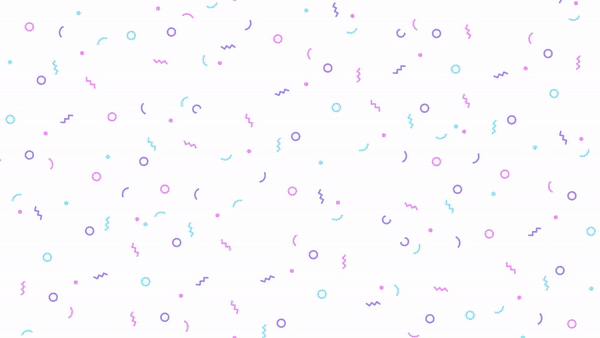
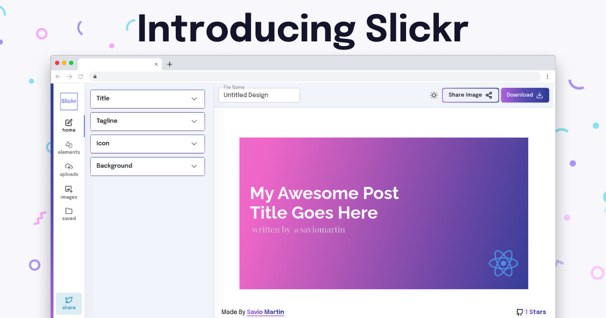

<p align="center">
  <a href="https://slickr.vercel.app/">
    
  </a>
</p>
<h1 align="center">Slickr✨️</h1>

<p align="center">
<a href="https://github.com/saviomartin/slickr/blob/master/LICENSE" target="blank">

</a>
<a href="https://github.com/saviomartin/slickr/fork" target="blank">

</a>
<a href="https://github.com/saviomartin/slickr/stargazers" target="blank">

</a>
<a href="https://github.com/saviomartin/slickr/issues" target="blank">

</a>
<a href="https://github.com/saviomartin/slickr/pulls" target="blank">

</a>
<a href="https://twitter.com/intent/tweet?text=Checkout%20slickr.vercel.app%20by%20@saviomartin7.%20The%20most%20powerful%20way%20to%20create%20awesome%20cover%20images%20for%20your%20@hashnode%20blog%20🔥"></a>

</p>

<p align="center"></p>

<p align="center">
    <a href="https://slickr.vercel.app/" target="blank">View Demo</a>
    ·
    <a href="https://github.com/saviomartin/slickr/issues/new/choose">Report Bug</a>
    ·
    <a href="https://github.com/saviomartin/slickr/issues/new/choose">Request Feature</a>
</p>

### Introducing Slickr ✌️

Slick is the most powerful and the easiest app to create beautiful cover images for your hashnode blog. Slickr lets you be flexible by handling backgrounds, gradients, patterns, images, icons, bookmarks, uploads and a lot more. You can drag, resize and position your components and give a new feel to your blog. When you're done export it as PNG, JPG, or SVG. Say hello to Slickr 🤟

[Read blog to understand better 📖](https://savio.xyz/introducing-slickr-the-most-powerful-cover-image-generator-for-your-hashnode-blog)

## 🚀 Demo

<a href="https://slickr.vercel.app/" target="blank">

</a>

Try the App: [Slickr](https://slickr.vercel.app/)

## 🧐 Features

Slickr comes up with a whole bunch of amazing features to provide you the best experience, Here're some of our best features.

> Supercharge your hashnode blog with slickr.

- 💯 **Draggable, Resizable, Wrappable**
- 🎩 **Upload your Images and use it**
- 👾 **32,000+ Icons** (powered by iconsfinder)
- 📦 **Use Images from Unsplash**
- 🔖 **Save Icons or Images**
- 🍭 **Edit Everything** (text, color, size, family, weight, lineheight etc)
- 🌱 **4 way backgrounds** (Solid, Gradient, Pattern, Image)
- 🥁 **Share Images** (Get Public Share URL)
- 🌘 **Dark mode**
- 👤 **Join using Google, Github, Facebook**
- 💻 **Fully Responsive**
- 🚀 **Fast Downloading**
- ⤵️ **Export as PNG, JPG, SVG**

Enjoy creating cover image for your hashnode blog like never before, get started in seconds ✨️

## 🛠️ Installation Steps

1. Clone the repository

```bash
git clone https://github.com/saviomartin/slickr.git
```

2. Change the working directory

```bash
cd slickr
```

3. Install dependencies

```bash
npm install
```

4. Create `.env` file in root and add your variables

```bash
NEXT_PUBLIC_UNSPLASH_CLIENT_ID=UNSPLASH_CLIENT_ID
NEXT_PUBLIC_IMGBB_STORAGE_KEY=IMGBB_STORAGE_ACESS_KEY
NEXT_PUBLIC_CLERK_FRONTEND_API=CLERK_FRONTEND_API
```

5. Run the app

```bash
npm run dev
```

You are all set! Open [localhost:3000](http://localhost:3000/) to see the app.

## 🍰 Contributing

- Please contribute using [GitHub Flow](https://guides.github.com/introduction/flow). Create a branch, add commits, and [open a pull request](https://github.com/saviomartin/slickr/compare).

- Please read [`CONTRIBUTING`](CONTRIBUTING.md) for details on our [`CODE OF CONDUCT`](CODE_OF_CONDUCT.md), and the process for submitting pull requests to us.

## 💻 Built with

- [Next JS](https://nextjs.org/)
- [Clerk](https://clerk.dev/): Complete User Authentication
- [react-color](https://casesandberg.github.io/react-color/): for color pickers
- [html2canvas](https://html2canvas.hertzen.com/): for export as PNG, JPG, SVG
- [react-rnd](https://github.com/bokuweb/react-rnd): for draggable and resizable components
- [react-icons](https://react-icons.github.io/react-icons/): for icons
- [nprogress](https://www.npmjs.com/package/nprogress): for slim progressbars
- [react-hot-toast](https://react-hot-toast.com/): for toasts
- [Material UI](http://material-ui.com/): for components
- [Vercel](http://vercel.com/): for hosting

## 🌈 What's next

Slickr is a special project made to empower the amazing hashnode community in the hop to see great articles with beautiful covers. Here are some of my plans ahead for Slickr 🤞

- `Ctrl+C` and `Ctrl+V` for components
- history of created covers **(in progress)**
- Export as GIF **(in progress)**
- Collaborate with patner
- Templates
- Better Position Tracker
- Rotatable, Scalable, Groupable Components

## 🛡️ License

This project is licensed under the MIT License - see the [`LICENSE`](LICENSE) file for details.

## 🦄 Deploy

<a href="https://vercel.com/new/project?template=https://github.com/saviomartin/slickr">

</a>
<a href="https://app.netlify.com/start/deploy?repository=https://github.com/saviomartin/slickr">

</a>
<a href="https://cloud.digitalocean.com/apps/new?repo=https://github.com/saviomartin/slickr">

</a>

## 👨‍💻 Author

### 👤 Savio Martin

- Twitter: [@SavioMartin7](https://twitter.com/SavioMartin7)
- Github: [@saviomartin](https://github.com/saviomartin)
- Hashnode: [@saviomartin](https://hashnode.com/@saviomartin)

## 🙏 Support

This project needs a ⭐️ from you. Don't forget to leave a star ⭐️

If you found the app helpful, consider supporting me with a coffee.

<a href="https://www.buymeacoffee.com/saviomartin">

</a>

---

<h3 align="center">
Slickr needs a ⭐️ from you
</h3>
